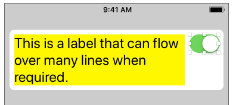
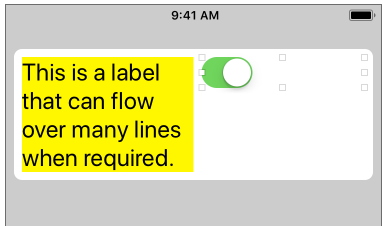

#  Stack View Unexpected Behaviour With Multi-Line Text Label

Number: 39275811  
Status: Open  
Product: iOS + SDK  UIKit  
Product Version: 11.3  
Date Originated: 9 April 2018    

## Summary

The stack view adds an undocumented optional constraint that pulls the views to an equal width when using multi-line text labels. This constraint has a higher priority than the default content hugging/compression priorities causing unexpected behavior.

## Steps to Reproduce

1. Add a label and a switch to a horizontal stack view in Interface Builder. Set the number of lines for the label to zero. Add text to the label sufficient to fill the width of the screen.

2. Add constraints to pin the stack view to the leading, top and trailing margins of the superview. Configure the stack view:
    - distribution: fill
    - alignment: top
    - spacing: standard.

3. Change the content layout priorities for the label as follows:
    - horizontal content hugging priority: 251
    - horizontal content compression resistance priority: 749

    (The default values for the switch are both 750 so the label should be stretched or squeezed to fit and the switch should stay as its intrinsic content size).

4. Build and run on iPhone 8 simulator (or device) in portrait.

## Expected Results:

The switch should stay at its intrinsic content size and the label should fill the available space flowing over multiple lines as required.

## Actual Results:

The label and switch are sized equally to fill half of the available width.

## Version/Build:

* Xcode Version 9.3 (9E145)
* iOS 11.3 (15E217)

## Workaround

Using the view debugger you an observe that the stack view has added an optional constraint labelled "UISV-text-width-disambiguation":

    label.width = 0.5 * stackView.width - 0 @ 759

This constraint has a higher priority than the default content hugging priority for the switch so it wins and pulls the width of the views to be half the width of the stack view.

To fix the issue you can raise the content hugging priority of the switch to be greater than 759.

This constraint is not documented and it should not be necessary to use the view debugger to discover what the stack view is doing before setting the priorities of the arranged subviews.

##  See Also

Bug report on Open Radar:

+ [rdar://39275811](http://openradar.appspot.com/39275811)

