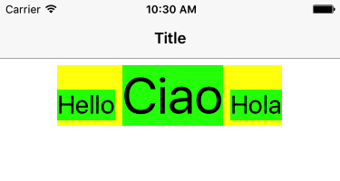
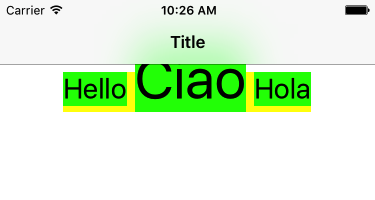

## Stack View height incorrect for first/last baseline alignment

Number: 32291130  
Status: Open  
Product: iOS + SDK  
Product Version: 10.3  
Date Originated: 19 May 2017  

### Summary

A horizontal stack view containing a number of text labels and using a first/last baseline alignment incorrectly sets its top/bottom edge to the top/bottom of the first arranged subview and not the text label that extends furthest above/below the baseline.

This means that when, for example, the second label in a horizontal stack view uses a larger font than the first label it will extend above the frame of the stack view causing unexpected layout issues.

### Steps to Reproduce:
1. Start from the Xcode single view application template and drag three labels into the Interface Builder canvas of the view controller.
2. Configure each label with some text ("Hello", "Ciao", "Hola") and set the font size to 28, 56 and 28 points respectively (the second label is using a font size twice the size of the other labels).
3. Embed the three labels in a horizontal stack view and change the alignment of the stack view to "First Baseline"
4. Add Auto Layout constraints to center the stack view horizontally and pin it to the top layout guide with standard spacing.
5. Build and run on a device or simulator. 

See attached Xcode project for full example

### Expected Result

The three text labels should all align on their first baseline and the stack view height should be set by the height of the second (tallest above baseline) text label. All of the text labels should be contained by the stack view, within the bounds of the stack view.

### Observed Result

The text labels align on their first baselines but the top edge of the stack view is set to the top edge of the first (and smaller) text label. This causes the taller second text label to extend above the bounds of the stack view and in this case to be appear under the top layout guide. 

### Notes

Looking at the configuration of the stack view with the view debugger it would appear to be missing constraints from the top of the stack view to the top of the 2nd and 3rd labels.

The first text label has a constraint with the top of the stack view as follows:
UISV-canvas-connection: stackView.top <= label.top @ 1000

This constraint is missing for the other two labels. A workaround is to add this constraint to each label:

    NSLayoutConstraint.activate([
      stackView.topAnchor.constraint(lessThanOrEqualTo: label2.topAnchor),
      stackView.topAnchor.constraint(lessThanOrEqualTo: label3.topAnchor)
       ])

###  See Also

Bug report on Open Radar:

+ [rdar://32291130](http://openradar.appspot.com/32291130)

